# Popular AI Logos

This repo contains the logos for popular AI companies and their models. These logos can be useful for creating figures in papers. All logos are available in both PDF and PNG formats.

## Anthropic
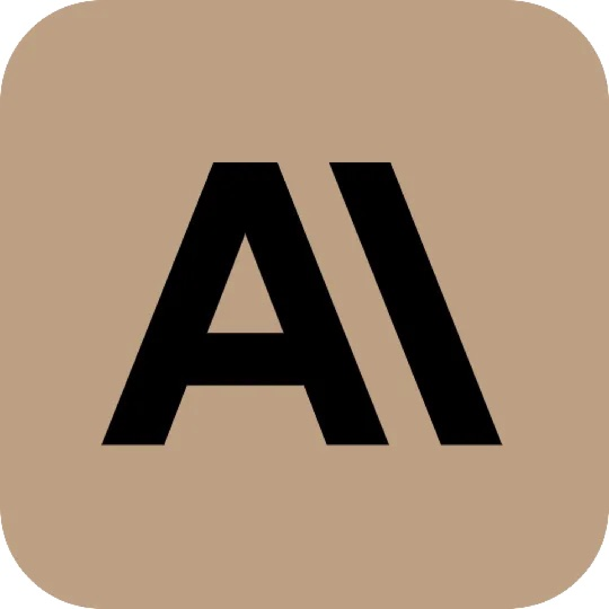

## Deepseek

## Google
 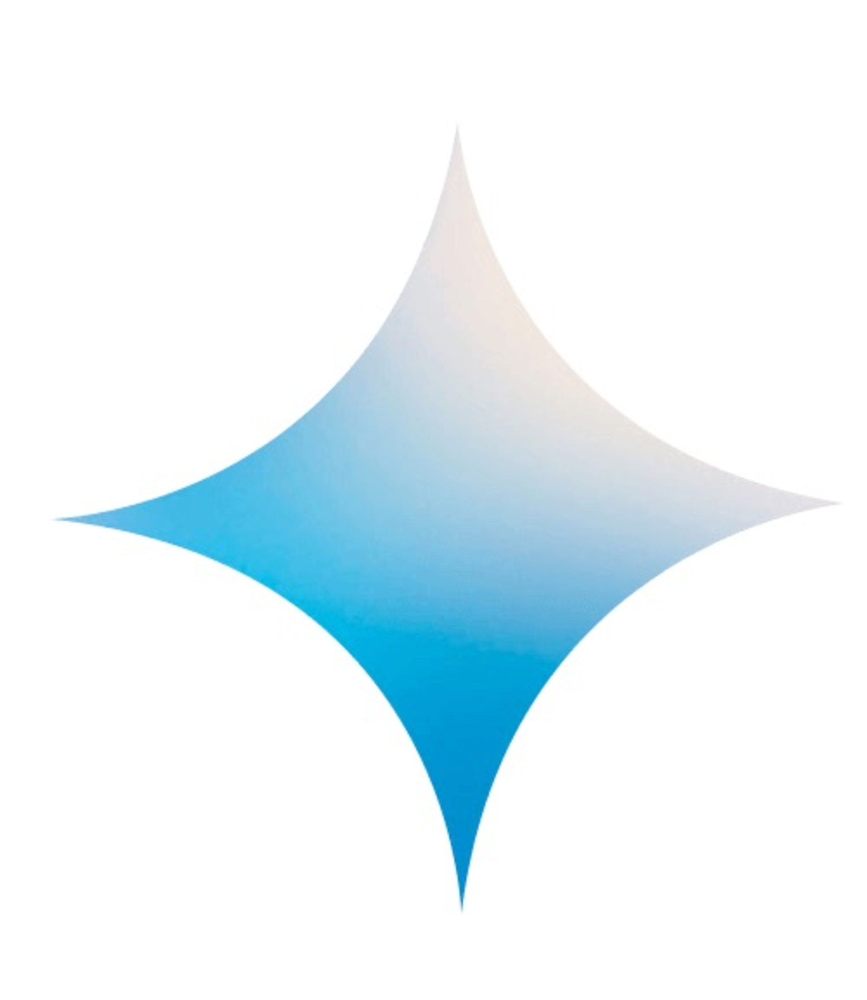 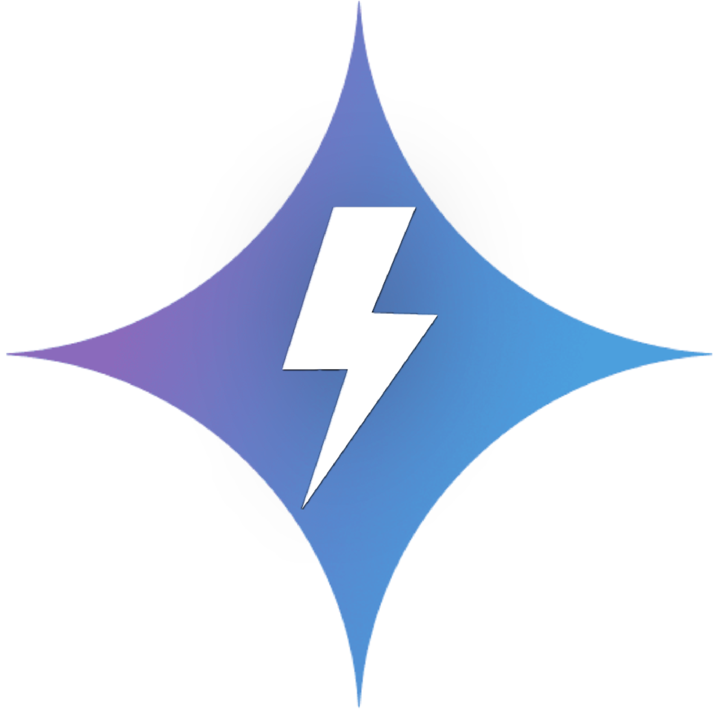 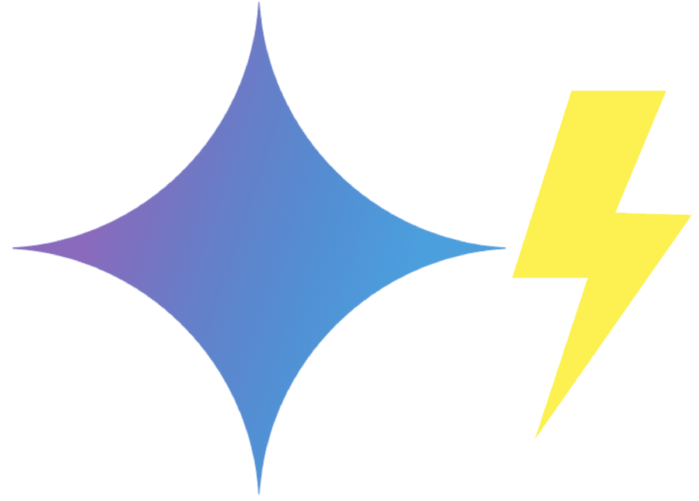

## Meta
 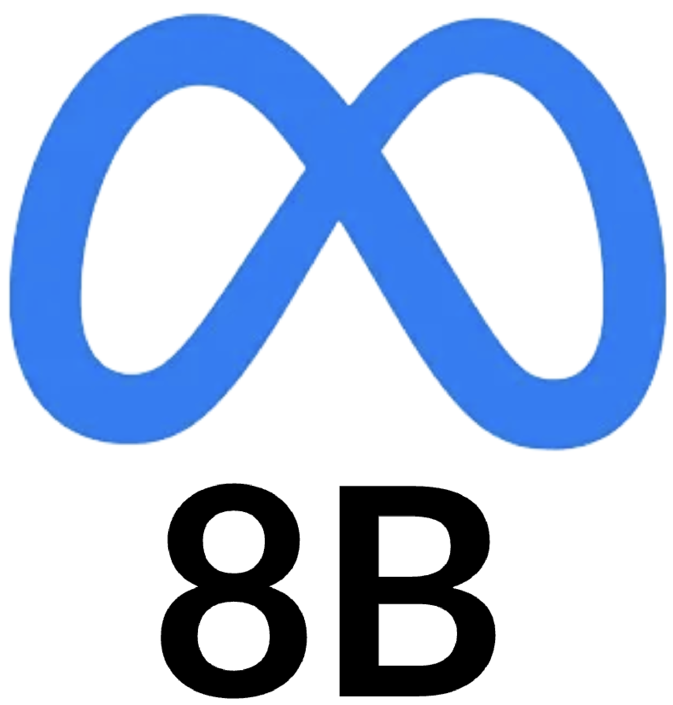 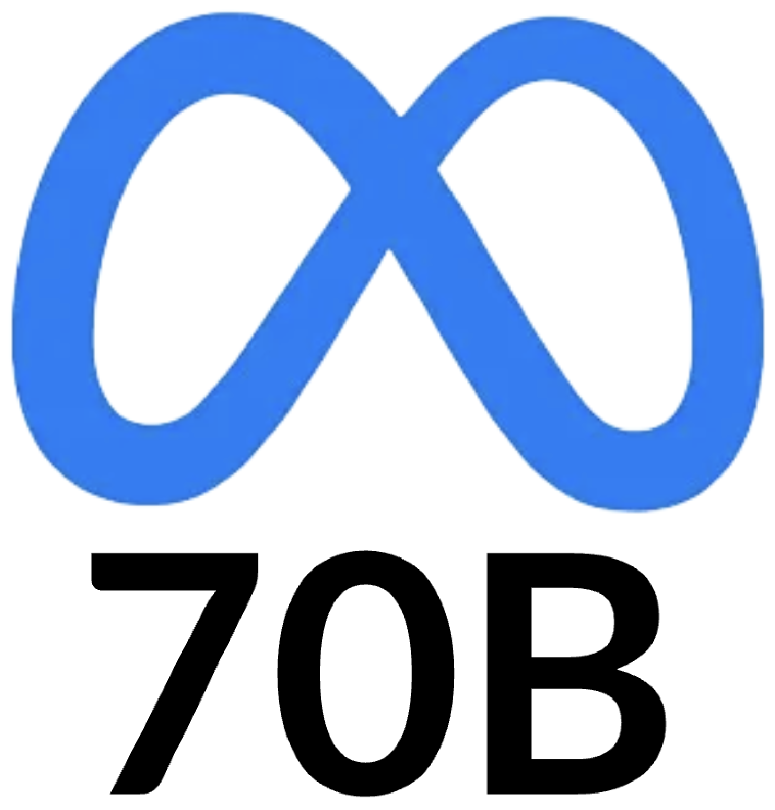 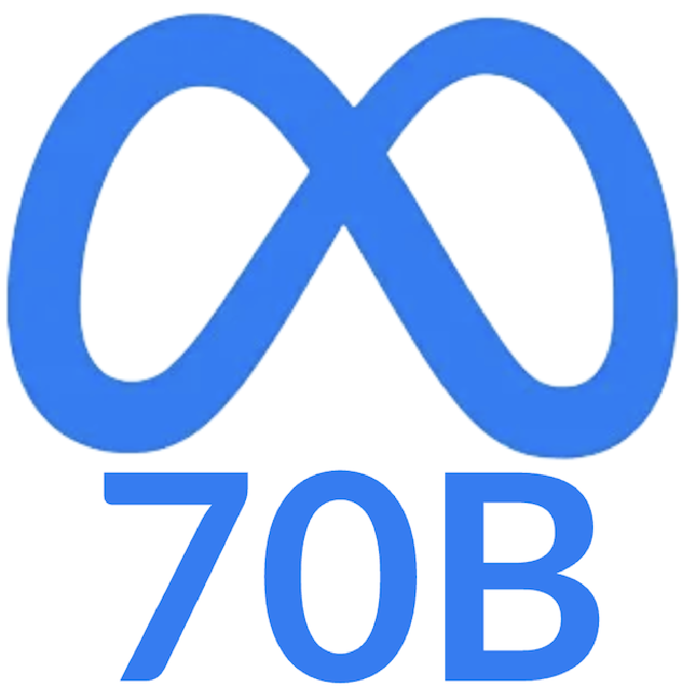 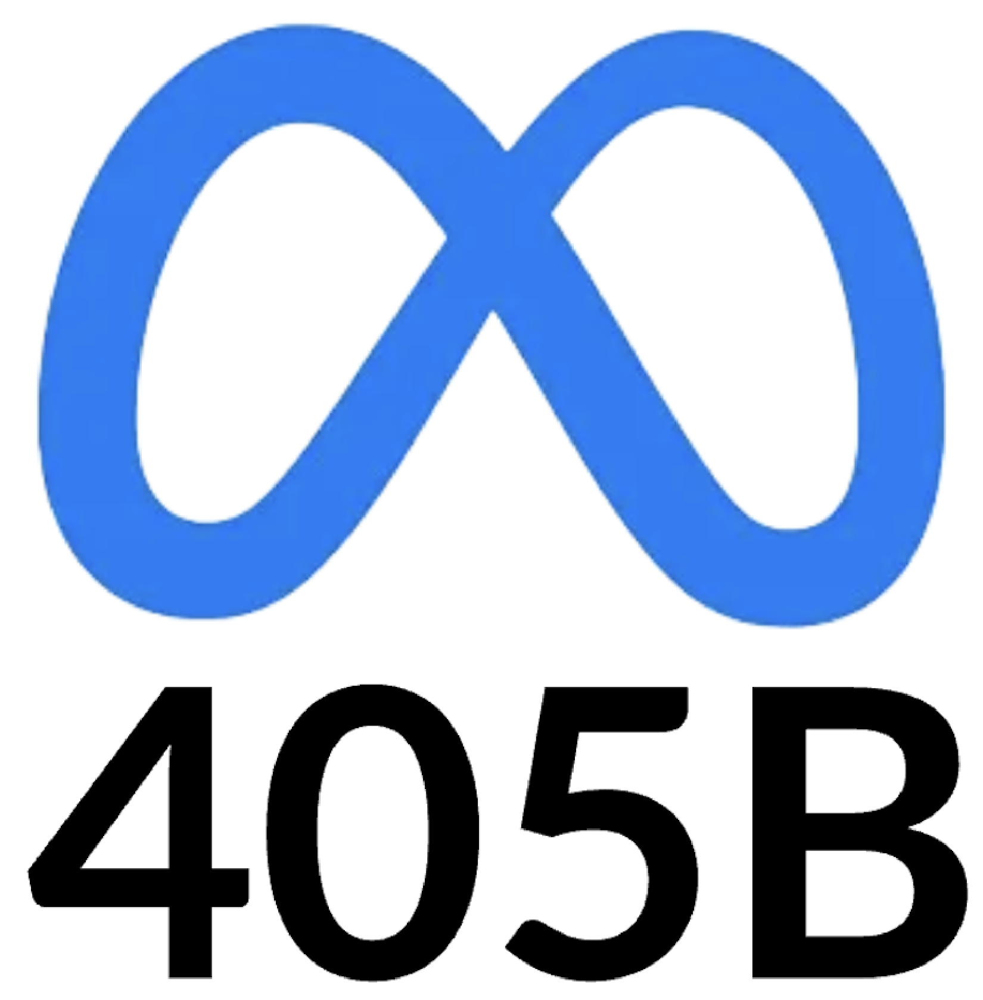 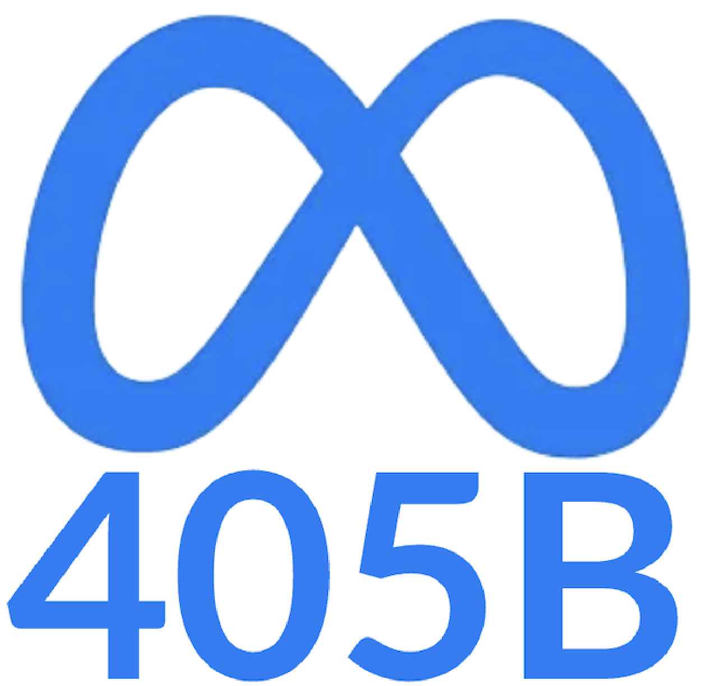 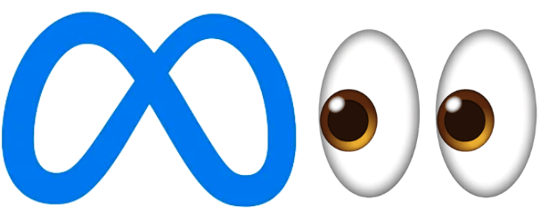

## OpenAI
  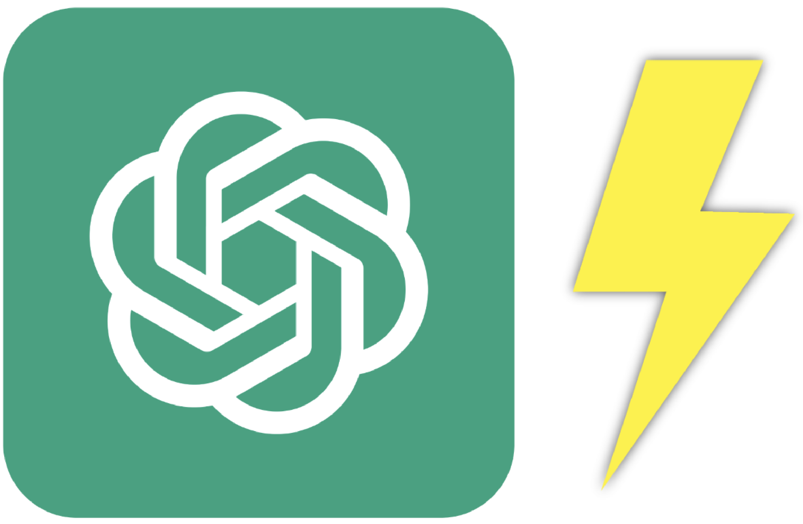

## Qwen
 
